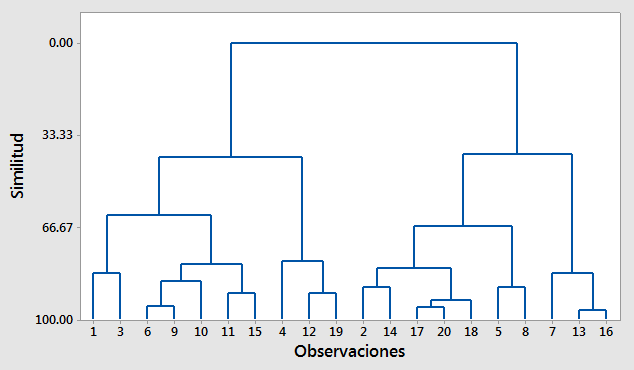
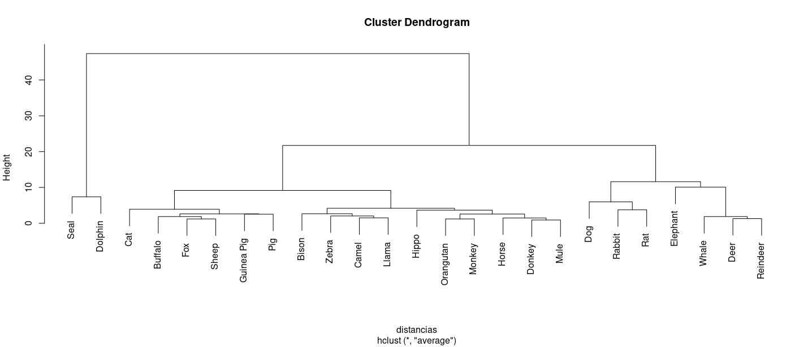

```{r setup, include=FALSE}
library(learnr)
library(paqueteMOD)
library(boot)
library(ggplot2)
library(gridExtra)
library(knitr)
library(broom)
library(stargazer)

knitr::opts_chunk$set(echo = FALSE,
                 exercise.warn_invisible = FALSE)
# colores
c1="#FF7F00" # NARANJA COLOR PRINCIPAL
c2="#034a94" # AZUL FUERTE COLOR SECUNDARIO  
c3="#0eb0c6" # AZUL CLARO COLOR TERCEARIO  
c4="#686868" # GRIS COLOR TEXTO 
##  <div class="content-box-blue">    </div> ## caja azul
```

## **PRESENTACIÓN**

```{r, echo=FALSE, out.width="100%", fig.align = "center"}
knitr::include_graphics("images/banner2.png")
```


El presente tutorial contiene preguntas relacionadas con l estimación del modelo y sus supuestos, conceptos importante para la compresión los proceso relacionados con la inferencia realizada sobre los resultados obtenidos por el método de MCO.   

</br>
  
#### **CONCEPTOS**
  
#### ** ** 


#### ** **


#### **Inferencia sobre los coeficientes**


#### **Inferencia sobre un subconjunto de coeficientes**


#### **Inferencia sobre pronósticos**


  
</br></br>

#### **MAPA** 
  

```{r, echo=FALSE, , out.width="100%", fig.align = "center"}
knitr::include_graphics("images/mapa2.png")  

```


</br></br>

#### **CÓDIGO R**

| concepto                   | código                                             |
|:---------------------------|:---------------------------------------------------|
                         | `predict(modelo, new_obs)` |

## **CUESTIONARIO**


### **Pregunta 1**

```{r q1}

quiz(
  question("El  principal objetivo del análisis de componentes principales es:" , 
          correct = "Correcto!.",
           allow_retry = TRUE,
           answer("Modelar la variable respuesta mediante la combinación lineal de un conjunto de covariables", message = "No, pero no...intentalo de nuevo!"),
           answer("Reducir la dimensionalidad de un conjunto de datos para así poder analizarlos en una menor dimensión perdiendo la menor cantidad de información",  correct = TRUE),
           answer("Pronosticar los valores futuros de una serie de tiempo mediante medias moviles", message = "Incorrecto. Intenta de nuevo!."),
           answer("Analizar los errores de un modelo de regresión lineal", message = "No...intentalo de nuevo!"),
           submit_button = "Enviar respuesta",
           try_again_button = "Intentar de nuevo"),
  caption = " "
)

```


### **Pregunta 2**

```{r q2}

quiz(
  question("El tipos de datos con los que se pueden realizar un ACP son: " , 
           correct = "Correcto!.",
           allow_retry = TRUE,
           answer("Datos cualitativos nominales", message = "No, pero no...intentalo de nuevo!"),
           answer("Datos en escala de intervalo", message = "No...intentalo de nuevo!"),
           answer("Solo datos cuantitativos discretos", message = "Incorrecto. Intenta de nuevo!."),
           answer("Datos cuantitativos, tanto continuos como discretos",  correct = TRUE),
           submit_button = "Enviar respuesta",
           try_again_button = "Intentar de nuevo"),
  caption = " "
)

```


### **Pregunta 3**

```{r q3}

quiz(
  question("El primer paso para iniciar  un ACP es:" , 
           correct = "Correcto!.",
           allow_retry = TRUE,
           answer("Estandarizar las variables", correct = TRUE),
           answer("Centrar cada variable, es decir, restarle su media", message = "No, pero no...intentalo de nuevo!"),
           answer("Calcular la matriz de correlaciones de las variables", message = "Incorrecto. Intenta de nuevo!."),
           answer("Calcular los vectores propios del conjunto de datos", message = "No...intentalo de nuevo!"),
           submit_button = "Enviar respuesta",
           try_again_button = "Intentar de nuevo"),
  caption = " "
)

```


### **Pregunta 4**

```{r q4}
quiz(
  question("La inercia o varianza explicada :" , 
           correct = "Correcto!.",
           allow_retry = TRUE,
           answer("Es el porcentaje de correlación parcial de cada par de variables del conjunto de datos", message = "No, pero no...intentalo de nuevo!"),
           answer("Es la cantidad de varianza total de las variables originales que es explicada por las componentes principales",  correct = TRUE),
           answer("Es la contribución de cada individuo a la conformación de cada componente principal", message = "Incorrecto. Intenta de nuevo!."),
           answer("Es la suma de los coeficientes de correlación para cada par de variables del conjunto de datos", message = "No...intentalo de nuevo!"),
           submit_button = "Enviar respuesta",
           try_again_button = "Intentar de nuevo"),
  caption = " "
)

```


### **Pregunta 5**

```{r q5}

quiz(
  question("La relación que existe entre las variables originales y las componentes principales es que :" , 
           correct = "Correcto!.",
           allow_retry = TRUE,
           answer("Las componentes principales son los valores ajustados de los modelos de regresión calculados mediante las variables originales", message = "No, pero no...intentalo de nuevo!"),
           answer("Las componentes principales son una productoria de la matriz de correlaciones", message = "No...intentalo de nuevo!"),
           answer("Las variables originales se pueden obtener realizando producto punto entre las componentes principales", message = "Incorrecto. Intenta de nuevo!."),
           answer("Las componentes principales son combinaciones lineales de las variables originales estandarizadas", correct = TRUE),
           submit_button = "Enviar respuesta",
           try_again_button = "Intentar de nuevo"),
  caption = " "
)

```


### **Pregunta 6**

```{r q6}

quiz(
  question("El número del total de componentes a retener es:" , 
           correct = "Correcto!.", 
           allow_retry = TRUE,
           answer("n: número de individuos", message = "No, pero no...intentalo de nuevo!"),
           answer("p: número de variables",  correct = TRUE),
           answer("n-p", message = "Incorrecto. Intenta de nuevo!."),
           answer("n*p", message = "No...intentalo de nuevo!"),
           submit_button = "Enviar respuesta",
           try_again_button = "Intentar de nuevo"),
  caption = " "
)

```


### **Pregunta 7**

```{r q7}

quiz(
  question("El objetivo principal del análisis de conglomerados es:" , 
           correct = "Correcto!.", 
           allow_retry = TRUE,
           answer("Emplear técnicas de mineria de datos para encontrar componentes principales"),
           answer("Agrupar objetos similares en categorías o clusters basándose en su similitud y diferencias en sus características o variables.",  correct = TRUE),
           answer("Agrupar objetos de acuerdo a su disimilitud", message = "Incorrecto. Intenta de nuevo!."),
           answer("Analizar los errores de un modelo de regresión lineal", message = "No...intentalo de nuevo!"),
           submit_button = "Enviar respuesta",
           try_again_button = "Intentar de nuevo"),
  caption = " "
)

```


### **Pregunta 8**

```{r q8}

quiz(
  question("El tipos de datos se pueden analizar con el análisis de conglomerados son:" , 
           correct = "Correcto!.",
           allow_retry = TRUE,
           answer("Datos cuantitativos y cualitativos",  correct = TRUE),
           answer("Solo datos cuantitativos contintuos", message = "No...intentalo de nuevo!"),
           answer("Solo datos cuantitativos discretos", message = "Incorrecto. Intenta de nuevo!."),
           answer("Solo datos cualitativos", message = "No, pero no...intentalo de nuevo!"),
           submit_button = "Enviar respuesta",
           try_again_button = "Intentar de nuevo"),
  caption = " "
)

```


### **Pregunta 9**

```{r q9}

quiz(
  question("La medida de similitud en el análisis de conglomerados es:" , 
           correct = "Correcto!.",
           allow_retry = TRUE,
           answer("Es una medida númerica que mide la correlación entre dos individuos", message = "No...intentalo de nuevo!"),
           answer("Es una medida en escala de intervalo que permite evaluar la similitud entre dos objetos o grupos", message = "No, pero no...intentalo de nuevo!"),
           answer("Es una medida de bondad de ajuste del análisis de conglomerados", message = "Incorrecto. Intenta de nuevo!."),
           answer("Es una medida numérica para evaluar la similitud o diferencia entre dos objetos o grupos", correct = TRUE),
           submit_button = "Enviar respuesta",
           try_again_button = "Intentar de nuevo"),
  caption = " "
)

```

### **Pregunta 10**

```{r q10}
quiz(
  question("El dendrograma y se interpretan : " , 
           correct = "Correcto!.", 
           allow_retry = TRUE,
           answer("Es un tipo de diagrama de árbol utilizado para representar las correlaciones entre los n individuos de la muestra.
                  ", message = "No, pero no...intentalo de nuevo!"),
           answer("Es un tipo de diagrama de árbol utilizado para representar la relación jerárquica entre las variables y los individuos, facilitando la selección de un número k de clusters", message = "Incorrecto. Intenta de nuevo!."),
           answer("Es un tipo de diagrama de árbol utilizado para representar la relación jerárquica entre los grupos y para ayudar en la selección del número óptimo de grupos.
", correct = TRUE),
           answer("Es un tipo de diagrama de bosques que ayuda a visualizar el aporte de cada variable a un modelo de regresión", message = "No...intentalo de nuevo!"),
           submit_button = "Enviar respuesta",
           try_again_button = "Intentar de nuevo"),
  caption = " "
)

```


### **Pregunta 11**

```{r q11}

quiz(
  question("El objetivo de los k-means es:" , 
           correct = "Correcto!.", 
           allow_retry = TRUE,
           answer("Dividir un conjunto de datos en k grupos de tal manera que la suma de las distancias cuadradas entre los objetos y el centroide de su grupo correspondiente sea máxima", message = "No, pero no...intentalo de nuevo!"),
           answer("Calcular un diagrama de arbol que permitirá saber el número óptimo de grupos a utilizar", message = "No...intentalo de nuevo!"),
           answer("Calcular las componentes principales para así representar la nube de individuos y el circulo de correlaciones", message = "Incorrecto. Intenta de nuevo!."),
           answer("Dividir un conjunto de datos en k grupos de tal manera que la suma de las distancias cuadradas entre los objetos y el centroide de su grupo correspondiente sea mínima", correct = TRUE),
           submit_button = "Enviar respuesta",
           try_again_button = "Intentar de nuevo"),
  caption = " "
)

```


### **Pregunta 12**

De acuerdo al siguiente dendograma y al criterio del mayor salto de nodo a nodo de las distancias euclidianas:
<center>
```{r, echo=FALSE, out.width="70%", fig.align = "center"}

```
</center>


```{r q12}
quiz(
  question("¿Cúal es el número óptimo de grupos a calcular?" , 
           correct = "", 
           allow_retry = TRUE,
           answer("5", message = "No, pero no...intentalo de nuevo!"),
           answer("2",  correct = TRUE),
           answer("4", message = "Incorrecto. Intenta de nuevo!."),
           answer("3", message = "No...intentalo de nuevo!"),
           submit_button = "Enviar respuesta",
           try_again_button = "Intentar de nuevo"),
  caption = " "
)

```


### **Pregunta 13**

<center>
```{r, echo=FALSE, out.width="100%", fig.align = "center"}

```
</center>

```{r quiz_13}
quiz(
  question("¿De acuerdo al criterio del mayor salto de nodo a nodo de las distancias euclidianas, el  número de grupos optimo es:" , 
           correct = "", 
           allow_retry = TRUE,
           answer("10", message = "No, pero no...intentalo de nuevo!"),
           answer("3",  correct = TRUE),
           answer("4", message = "Incorrecto. Intenta de nuevo!."),
           answer("5", message = "No...intentalo de nuevo!"),
           submit_button = "Enviar respuesta",
           try_again_button = "Intentar de nuevo"),
  caption = " "
)
```


## **PROBLEMAS**


### **Problema 1**

La base `beer2` contenida en `paqueteMOD` contiene las siguientes características de un conjunto de 69 marcas diferentes de cervezas:

* **precio** : precio por unidad de 12 oz
* **calorias** : cantidad de calorías por unidad de 12 oz
* **poralcoh** : porcentaje de alcohol por unidad de 12 oz

Reduzca el número de variables utilizando Componentes Principales

**Nota**: En ocasiones es posible darle nombre a cada uno de los componentes observando los pesos de las variables en sus respectivos componentes principales. En este caso se espera que uno de los componentes resuma las variables relacionadas con las características de composición de la cerveza y que el precio quede separado en un segundo componente. Valide estos resultados esperados.


```{r p1, exercise=TRUE, exercise.lines = 5}
library(paqueteMOD)
data("beer2")


```


```{r p1-hint}
library(paqueteMOD)
data("beer2")
ACP = dudi.pca(beer2, scannf=FALSE, center = TRUE, scale = TRUE)
```

```{r p1-solution}
library(paqueteMOD)
data("beer2")
ACP = ade4::dudi.pca(beer2, scannf=FALSE, center = TRUE, scale = TRUE)
ACP$co
```


### **Problema 2**

La base `beer2` contenida en `paqueteMOD` contiene las siguientes características de un conjunto de 69 marcas diferentes de cervezas:

* **precio** : precio por unidad de 12 oz
* **calorias** : cantidad de calorías por unidad de 12 oz
* **poralcoh** : porcentaje de alcohol por unidad de 12 oz

Al extraer los componentes principales de una base de datos permite además de encontrar nuevas variables llamadas componentes, contar con gráficos que permiten visualizar la relación que existe entre las variables, para ello se requiere construir el circulo de correlaciones (representación de variables)

Construya el gráfico de varibles y confirme las relaciones entre las variables descritas en las composiciones de los dos componentes principales resultantes :


```{r p2, exercise=TRUE, exercise.lines = 10}
library(paqueteMOD)
data("beer2")
ACP = ade4::dudi.pca(beer2, scannf=FALSE, center = TRUE, scale = TRUE)

```

```{r p2-hint}
library(paqueteMOD)
data("beer2")
ACP = ade4::dudi.pca(beer2, scannf=FALSE, center = TRUE, scale = TRUE)
# factoextra::fviz_pca_var()
```

```{r p2-solution}
library(paqueteMOD)
data("beer2")
ACP = ade4::dudi.pca(beer2, scannf=FALSE, center = TRUE, scale = TRUE)
# factoextra::fviz_pca_var(ACP)
```


### **Problema 3**

La base `beer2` contenida en `paqueteMOD` contiene las siguientes características de un conjunto de 69 marcas diferentes de cervezas:

* **precio** : precio por unidad de 12 oz
* **calorias** : cantidad de calorías por unidad de 12 oz
* **poralcoh** : porcentaje de alcohol por unidad de 12 oz

Al realizar una análisis de componentes principales sobre una base de datos es posible representar tanto los individuos como las variables en un solo gráfico, permitiendo observar las relaciones entre variables e individuos

Muestre la representación simultanea de individuos y variables en el primer plano factorial

```{r p3, exercise=TRUE, exercise.lines = 5}
library(paqueteMOD)
data("beer2")
# ACP = factoextra::dudi.pca(beer2, scannf=FALSE, center = TRUE, scale = TRUE)

```

```{r p3-hint}
library(paqueteMOD)
data("beer2")
# factoextra::fviz_pca_biplot()
```

```{r p3-solution}
library(paqueteMOD)
data("beer2")
ACP = ade4::dudi.pca(beer2, scannf=FALSE, center = TRUE, scale = TRUE)
# factoextra::fviz_pca_biplot(ACP)
```


### **Problema 4**


La base de datos `animals` de `paqueteMOD`  contiene  la composición de la leche de  25 especies de animales :

* **water**: porcentaje de agua. 
* **protein**: porcentaje de proteína. 
* **fat**: porcentaje de grasa. 
* **lactose**: porcentaje de lactosa. 
* **ash**: porcentaje de cenizas.

El análisis de conglomerados permite clasificar las observaciones en grupos, utilizando para ellos medidas denominadas de disimilaridad dentro de las cuales se destaca la distancia euclidiana y ténico o procedimientos como el método del vecino más cercano.

Use la función `kmeans`  contenida en el paquete  ``  para encontrar análisis de conglomerados optimo mediante kmeans, 

**Nota** : Esta función se tiene el argumento `centers` el cual es el numero optimo de grupos que encontró anteriormente

Calcule el dendograma del conjunto de datos, primero calcule las distancias euclidianas mediante la funcion `dist` y despues el dendograma con la función `hclust`


```{r p4, exercise=TRUE, exercise.lines = 5}
library(paqueteMOD)
data("animals")

```


```{r p4-hint}
library(paqueteMOD)
data("animals")
# distancias <- dist( , method = "euclidean")
# dendograma <- hclust( , method = "average")
```

```{r p4-solution}
library(paqueteMOD)
data("animals")
# distancias <- dist(animals, method = "euclidean")
# dendograma <- hclust(distancias, method = "average")
# plot(dendograma)
```


